# 🩺 AI Medical Diagnostics Agent


## 🏥 Overview

**AI Medical Diagnostics** is a state-of-the-art multi-agent system designed to simulate a multidisciplinary medical team. By leveraging the power of Large Language Models (LLMs) and agentic workflows, this application provides comprehensive analysis of patient medical reports.

The system orchestrates a team of specialized AI agents—a **Cardiologist**, **Psychologist**, and **Pulmonologist**—who concurrently analyze patient data. Their findings are then synthesized by a **Multidisciplinary Team Lead** to generate a final, holistic diagnosis and treatment recommendation.

## ✨ Key Features

- **🤖 Multi-Agent Architecture**: Specialized agents focused on distinct medical domains (Cardiology, Psychology, Pulmonology).
- **⚡ Concurrent Processing**: Utilizes `ThreadPoolExecutor` for parallel agent execution, ensuring fast response times.
- **👨‍⚕️ Multidisciplinary Synthesis**: A dedicated team lead agent aggregates specialist insights for a unified diagnosis.
- **🎨 Premium UI/UX**: Built with Streamlit, featuring a dark-themed, professional, and responsive interface.
- **🔒 Secure Configuration**: Environment variable management for API keys using `python-dotenv`.

## 🏗️ Architecture

The system follows a hierarchical agentic workflow:

```mermaid
graph TD
    User[Patient / User] -->|Input Medical Report| App[Streamlit Interface]
    App -->|Distribute Data| Agents
    
    subgraph Agents [Specialist Agents]
        direction TB
        Cardio[🫀 Cardiologist]
        Psych[🧠 Psychologist]
        Pulmo[🫁 Pulmonologist]
    end
    
    Cardio -->|Report| MDT[👨‍⚕️ Multidisciplinary Team]
    Psych -->|Report| MDT
    Pulmo -->|Report| MDT
    
    MDT -->|Final Diagnosis| Output[Final Report]
    Output --> App
```



## 🚀 Getting Started

### Prerequisites

- **Python 3.9+**
- **API Keys**: You will need API keys for the LLM provider (e.g., OpenAI, Groq, or Ollama setup).

### Installation

1.  **Clone the Repository**
    ```bash
    git clone https://github.com/yourusername/HealthCare_AI_Agent.git
    cd HealthCare_AI_Agent
    ```

2.  **Create a Virtual Environment**
    ```bash
    python -m venv venv
    # Windows
    .\venv\Scripts\activate
    # macOS/Linux
    source venv/bin/activate
    ```

3.  **Install Dependencies**
    ```bash
    pip install -r requirements.txt
    ```

### Configuration

1.  Create a file named `apikey.env` in the root directory.
2.  Add your API keys and configuration variables:
    ```env
    # Example configuration
    OPENAI_API_KEY=your_openai_api_key_here
    # Add other necessary keys based on Utils/Agents.py requirements
    ```

## 💻 Usage

Run the Streamlit application:

```bash
streamlit run app.py
```

The application will open in your default browser at `http://localhost:8501`.

1.  Paste a patient's medical report into the text area.
2.  Click **"🔍 Analyze Report"**.
3.  View individual specialist reports and the final multidisciplinary diagnosis.

## 🛠️ Tech Stack

- **Frontend**: [Streamlit](https://streamlit.io/)
- **Orchestration**: [LangChain](https://www.langchain.com/)
- **LLM Integration**: LangChain Community / OpenAI / Ollama
- **Environment**: Python-dotenv
- **Testing**: Pytest

## 📂 Project Structure

```text
HealthCare_AI_Agent/
├── 📂 Medical Reports/      # Sample medical reports
├── 📂 Utils/                # Helper modules
│   └── Agents.py            # Agent definitions (Cardiologist, etc.)
├── 📂 tests/                # Unit tests
├── app.py                   # Main Streamlit application
├── apikey.env               # Environment variables (not committed)
├── requirements.txt         # Project dependencies
└── README.md                # Project documentation
```

## 📄 License

This project is licensed under the MIT License - see the [LICENSE](LICENSE) file for details.

---
*Disclaimer: This tool is for educational and assistive purposes only and does not replace professional medical advice.*
